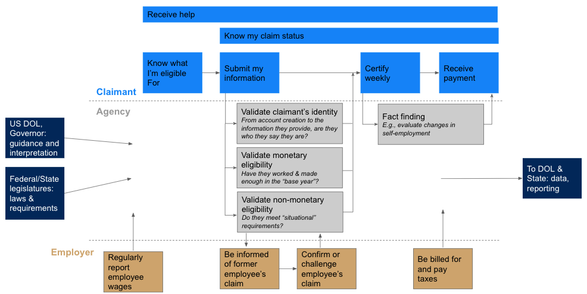

# The Journey Map

Journey maps are a way to visualize how users interact with a system. In Unemployment Insurance, there are four key user groups, each represented by a different color on the map:

* People seeking UI benefits, “claimants” \(light blue\)
* Government staff administering the program, “agency” \(gray\)
* Companies that pay into the system, “employers” \(gold\)
* Other government actors: Federal and State legislatures, Governors, and the US Department of Labor \(dark blue\)

Each box of the journey map represents a key step in the process. The unemployment insurance \(UI\) journey begins in the top left with a claimant trying to figure out whether they are eligible for any UI programs at all. 

As claimants go through the process from left to right, the UI agency does a lot of work in the background. The agency takes direction from US Department of Labor as well as state-level stakeholders like State Legislatures and Governors; they also report back to those entities as directed. The agency also facilitates communication with employers where appropriate to help validate information provided by the claimant.

This map is not intended to be a complete picture of the UI system; for example, it doesn’t capture what happens if someone is found ineligible at any point. As our research continues, we expect to refine and expand this map over time.

  

