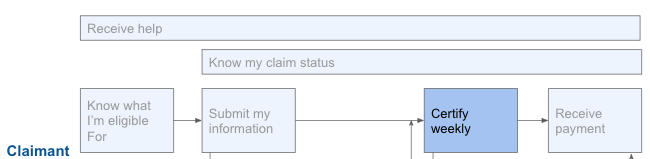

# Certify Weekly

## Challenge \#1: Small time windows to certify benefits each week don’t work 

Some states require you to certify within certain time windows \(as small as 30 minutes\) as a way to balance web traffic load.

### What our partners are saying:

* It increases the amount of times that someone is going to be able to mess up their claim: "It’s like running the gauntlet every week. If anything changes, one error will throw you down a path that will cause delays for the claimant and us that may require manual intervention Weekly certification is something that US DOL will not relax even though everyone has asked, maybe once every two weeks, because of sake of anti-fraud measures, they see this as another checks and balances in regards to certifying for benefits." - State B 

### Recommendation: 

1. Agencies should find alternative ways to balance traffic loads. The load generated by certification should be extremely small.

## Challenge \#2: Certification questions are difficult to understand

Certification questions are complex and difficult to understand and updating them requires the state to work with the Department of Labor. People are nervous that if they click the wrong option, they’ll lose their benefits.

### What our partners are saying:

* "We identified questions that were confusing to claimants. Available to work and telework questions...the original language that DOL recommended and drafted was very confusing.” -- State C 
* "Systems haven’t been translated to serve underrepresented populations \[or people\] who don’t speak “UI language,” which is not human language, but it’s built into our system. Some of this language is mandated by DOL; it’s been adopted as the norm across policy and programs.” -- State F 

### Recommendations:

1. US DOL should provide guidance and draft communications for states that has already been put into into [plain language](http://plainlanguage.gov) and usability tested for clarity in English, Spanish, and other key languages as requested by states. 
2. If US DOL or one of its regional offices works with an individual state on changing any communications, that should be shared out with other states so everyone can benefit from that and doesn’t need to be re-done by others.

