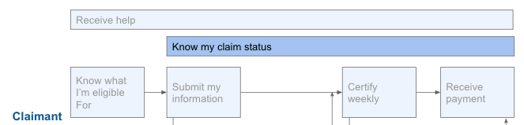

# Know my claim status

## Challenge \#1: Claimants aren’t able to easily check their status

State UI systems often have no digital status-checking method as it can be hard for the website to display succinct information across multiple backend systems. This requires claimants to call customer support to find out what is going on with their claim.

### What our partners are saying:

* "People also think of many of these apps similar to a bank loan. They expect to put in information and then see a status. Our system and laws and regulations, it’s not that simple. So there’s a disconnect between what people expect to see and expect to be able to understand about their app and their benefits, and what we’re able to give them based on the restrictions in our system" - State B 
* “People at the call center are looking at 7 different systems: this one says you got paid this way, there’s \[an issue over here, so it’s\] hard to give clear claim status. We want to give people a weekly or monthly statement of what you got paid. Doing that right now combines a bunch of system and not easy to do.” -- State C 
* "It’s not obvious whether you’re waiting for the state to do something, or if the state is waiting for you to do something. You don’t have visibility into what’s going to happen next. Anybody with much anxiety is going to call in order to confirm information" -- State F

### Recommendations: 

1. Agencies should iterate toward a complete status-checking experience - they shouldn’t try to do it all at once. E.g., it’s impactful to show someone their initial application status even if you can’t yet show weekly certification status or vice versa, or to show that a weekly certification was deemed eligible even if you can’t yet show how much/whether they have been paid.
2. Agencies should consider providing claimants with a way to check their status via automated phone, web chat, or SMS in addition to \(or even as a step before\) being able to check their status on the website.

## Challenge \#2: Terms used to describe benefit status are not user-friendly 

The language used to convey application status is often meaningless to claimants; “application pending” could mean any number of different things

### What our partners are saying:

* "When we send out letters to use this language like adjudication or pending issues or ICON, no one knows what that means. One of the problems is there are so many different details that we need to work out to process their claim to describe them in easily understandable language." -- State A
* "There are generic statuses, like ‘pending.’ But you wouldn’t know why. If we are waiting for missing wages, the claimant would have no idea what’s happening. This is a big pain point for the claimant and for us. It generates a lot of calls. The Domino's app approach \(you can see the pizza being made, you can see it being delivered\) would be a lot better. Right now it’s a black hole." -- State F

### Recommendations: 

1. Communicate in [plain language](https://www.plainlanguage.gov/) what the status is; statuses should be descriptive yet concise. 
2. Statuses should be contextualized within the whole process, e.g. a progress bar. 
3. Statuses should also include the following supporting information: 
   * Any decisions that have been made, and ideally the ability to begin an appeals process on that decision from that point.
   * What issue\(s\) are set on the claim, as well as what \(if anything\) is needed from the claimant; claimants shouldn’t be left wondering if they’ve missed a communication. 
   * What benefits have been disbursed, if any.

