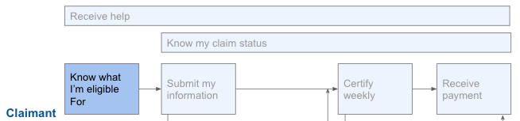

# Know what I'm eligible for

## Challenge \#1: Difficulty understanding eligibility and benefits

Unemployment insurance is a complex system with many factors impacting eligibility and compensation amount. The way that UI agencies determine and communicate monetary and non-monetary eligibility independently is confusing: e.g., you’re told that your situation may qualify you for UI benefits, but also that you didn’t work enough hours in the base period to actually get any benefits -- or you’re told that you would get a certain amount if you qualify for UI benefits but that you don’t actually qualify. 

The complication of UI systems was exacerbated when the 2020 CARES Act added three new programs to be administered through UI systems: Pandemic Unemployment Assistance \(PUA\), providing a base of benefits for gig workers and the self employed who are not eligible for standard UI; Pandemic Emergency Unemployment Compensation \(PEUC\), which extended the number of weeks someone could collect standard UI; and Federal Pandemic Unemployment Compensation \(FPUC\), which initially added an extra $600 to both UI and PUA for a period of time. 

People were getting information about these programs from the news, from their friends and family, and from various forums online in addition to what was made available by the administering UI agency; the lack of straightforward explanations led to incorrect expectations about what they are eligible for and how much they would receive.

### What our partners are saying: 

* "It’s like an evil MC Escher painting. You think you’re walking through one door of eligibility and end up on the stairs of something else" --State B 
* "There are so many programs \[in addition to unemployment insurance\]: disability, temporary leave, etc. It’s hard for a consumer to know \[what is going to be the best fit for them\] unless they go through fantastically designed charts or FAQs, which they don’t usually do" -- State B 
* "Just straight UI claims - people just say give me my money, \[but\] there are lots of eligibility requirements around both monetary \[amount and situations\] with rules and laws. It’s not just about the fact that you’re not working,” and that’s hard for people to understand. -- State B 

### Recommendations: 

1. Agencies should se [plain language](https://www.plainlanguage.gov/) when explaining programs and eligibility. 
2. When there are multiple programs that someone might be eligible for, agencies should ideally implement a [benefits eligibility screening tool](https://getstarted.nj.gov/labor/), but at the very least provide an [eligibility checklist](https://esdorchardstorage.blob.core.windows.net/esdwa/Default/ESDWAGOV/Unemployment/UIEligibilityChecker.pdf), or [eligibility FAQ page](https://labor.alaska.gov/unemployment/COVID-19.htm) to help guide claimants to the right program\(s\). 
3. Agencies should make it clear that the benefit is taxable and provide an opportunity to withhold that amount \(if state law doesn’t permit withholding, that should change in partnership with the state legislature\). If the claimant chooses not to withhold, the implications of not doing so should be clear in the application.
4. Agencies should perform usability studies on how people are informed of their \(in\)eligibility determinations to understand what specific communications should be streamlined and/or re-written. Communicate benefits receipt as a clear approve/deny in a single letter, with additional information about benefit amount or reason\(s\) for not qualifying for any benefits.

## Challenge \#2: Implementation of PUA was confusing

To be eligible for Pandemic Unemployment Assistance \(PUA\), a claimant must first apply for standard unemployment insurance and be rejected before applying for PUA, many times with the same information as in the initial application. States did not do an effective job communicating this to claimants and helping them navigate the process. 

The impact is an unknown decrease in benefits participation rate, which resulted in people not getting the help they need and are qualified for.

### What our partners are saying:

* "There is a DOL requirement that we deny people UI before we give them PUA. So we have people understanding that they can apply for PUA, should apply for PUA, but why they were denied for UI is super confusing. \[We should have been\] able to do some assessment and offer you just the PUA link, that’s what you’re eligible for based on your application. \[...\]  It’s amplified the risk that people don’t understand what’s happening. \[...\] There’s a pretty big drop-out rate there where they don’t then go to apply to PUA, but we haven’t spent time hunting that down." -- State F 

### Recommendations: 

1. Agencies should connect applications when possible: If there are programs whose eligibility depends on not qualifying for other programs, application information should be sent from one to the other so that claimants don’t need to re-enter information they’ve already provided.
2. If it is going to take any amount of time to determine whether they are eligible for the first program, agencies should communicate this clearly and let them know what to expect. 
3. If someone is found to be ineligible for the first program, agencies should use the information already obtained to determine whether they might be eligible for the second program and help them through that process. Do not rely on them knowing that they need to apply for something else.

## Challenge \#3: Lead time for new projects is often longer than the public expects

New programs take time to establish and they can be difficult for state agencies to set up. People get confused and angry about the delays, believing that benefits should be available as soon as the program is mentioned in media coverage.

### What our partners are saying:

* Legislation doesn’t take into account the feasibility or ease of enacting programs: “Every time Congress sneezes, we catch a cold. We went through this during the last recession, too. Let’s figure out what this should look like next time; assistance should be built atop existing code that can just be activated" -- State C
* "What people hear is that there’ll be $300 more in your account tomorrow. And that’s not how it works, we have to reprogram everything." -- State D

### Recommendations: 

1. US DOL should consult with states when any federal timelines are established to ensure that there is a reasonable implementation period. US DOL should help states in communicating the implementation timeline, especially if the legislation did not provide sufficient time.
2. Agencies should be as clear as possible about when the program will be operational; communicate changes to that timeline as they happen. Remain empathetic about what the claimants might be experiencing as they await aid.
3. US DOL should engage with states in a user-centered policy making process to understand the challenges with implementing new programs during crisis. That information should then be used to inform emergency legislation in future crises, as well as grant programs for UI agencies to prepare for recession-era programs ahead of time.

