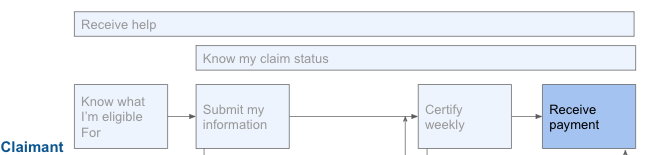

# Receive Payment

## Challenge \#1: Distributing benefits via prepaid debit card doesn’t work for all

Many states limit how funds can be received, including only providing benefits via a prepaid debit card. Prepaid debit cards are targets for both physical and digital fraud, and enable banks to withhold or retract funds that they think were obtained fraudulently \(without being asked by the state to do so\).

### What our partners are saying:

* "There’s also a challenge with new filers in the system who may have had a paid family leave or disability claim in the past four years. Those UI payments would go onto that same card. So if they lost that card or threw it away, there can be some challenges where the claims are crossing over to same benefit payment method but claimant doesn’t realize that and so there’s challenge" -- State B 
* People ask for Venmo more than they ask for checks --State B 
* "Direct deposit is great for people who are housing-unstable. Otherwise getting the debit card to people is a challenge. There are some non-traditional banks that act as direct deposit, and that’s helped. You can go into Walgreen’s and get a card that acts as a direct-deposit mechanism, so there are options for the unbanked." -- State F

### Recommendation:

1. Arizona, California, Maryland, Nevada, and Oklahoma should enable direct deposits of UI benefits without having to mail in a voided check or first get a debit card.

## Challenge \#2: Benefits may be stolen if a claimant’s user account is compromised

Claimants UI system accounts can be hacked and their bank account info changed so that someone else gets their benefits.

### What our partners are saying:

* "We ask them to validate their identity using the exact same process every time we have an identity question. The process earlier, they’d do the same thing later, you can imagine how frustrating in the first place, and you had to do it again for opaque reasons, it might seem like we’re putting you on, in the nicest version of that. It’s a particularly frustrating point of the system for me. " -- State F 
* "The changing of bank accounts has been a strong indication of possible fraud, so there’s a two-day hold if people change bank account information. This can result in people in need of money being delayed." -- State F

### Recommendation: 

1. Agencies should assume that bank account changes are hostile actions and require authentication beyond simply logging into the account. Be clear with the claimant about what is happening at that time and how to confirm legitimate changes.

