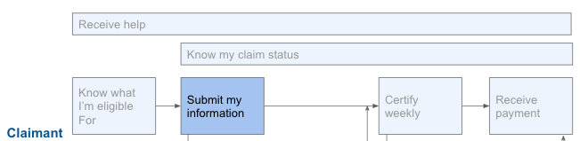

# Submit my information

## Challenge \#1: Current user experience is confusing

Current UI systems are not designed to simplify the claimant’s experience. Application questions are complex and difficult to understand. People are nervous and worry that clicking the wrong option will result in losing their benefits by mistake. They don’t always provide the correct information; claimants  might send over too much information, which can confound and complicate decision making, or not enough information, which lengthens the process. Online applications are not always mobile-optimized and frequently aren’t translated into the languages needed for the state’s population.

### Recommendations

1. Use [plain language](https://www.plainlanguage.gov/) in the tools to help claimants better understand what is expected of them. 
2. Explain the outcome of actions that the claimant takes or of answers they provide. 
3. When additional information is needed, be very clear about what that information is and why it is needed. Uploading attachments should be available to claimants in the context of a targeted request for information from the agency, or as part of an issue creation/appeals workflow that the claimant initiates.
4. From “[Centering Workers - How to Modernize Unemployment Insurance Technology](https://tcf.org/content/report/centering-workers-how-to-modernize-unemployment-insurance-technology/)”: 
   1. Create a substantive, accessible claimant portal. 
   2. Go for a professional look.
   3. Make your website mobile-optimized. 
   4. Design a sensible password reset process. 
   5. Make online and mobile systems available 24/7.
   6. Automatically save incomplete applications, and provide a warning before timing out. 
   7. Allow customers to choose email or texting as a communications method.
   8. Permit customers to email in or upload documents from a computer or mobile device. 
   9. Avoid automated decision-making.
   10. Use plain language and smart questioning. 
   11. Translate the application and other online materials into Spanish and other commonly spoken languages. 
   12. Minimize the paperwork burdens associated with work search.

## Challenge \#2: Websites can’t handle the traffic volume 

Some systems were not built for increased web traffic load. This has resulted in some states trying to limit what days or times individuals can apply or do their weekly certification in order to balance web traffic load. 

### Recommendation:

1. Put in place scaling plans and determine what will change in the system when there are large spikes in traffic. Take into account DDOS attacks as well as bot traffic. 

## Challenge \#3: Websites aren’t designed for the people who need it 

Not everyone has access or sufficient digital skills to use the website.

### What our partners are saying:

* "The people impacted by this pandemic are blue collar, they’re in socioeconomic groups that may be put at disadvantage as particular industries, educational background, they’re at a disadvantage due to complexity of system and ability to apply for claims, plus a language barrier that’s highlighted." -- State B

### Recommendations: 

1. Create a process for phone applications and certifications and make sure that a phone line is available specifically for that purpose. This phone line should be separate from getting help with online applications or handling existing application or status issues. 
2. Maintain a process for handling paper applications. 
3. When possible to do safely, in-person “pop up” offices in targeted locations can help provide assistance. Think through the time commitment and resource constraints before setting expectations with the public.  
4. Enable claimants to schedule phone callback appointments to preemptively avoid long hold times.

## Challenge \#4: Unclear expectations about next steps

Unlike most of the online interactions people have, UI systems frequently aren’t able to tell you right away what the status of your application is. If an issue is detected, or the application needs to be processed by the mainframe in a batch overnight, a claimant is left wondering what’s going on. When the system doesn’t tell them what is going to happen next or on what time frame, then claimants have undue anxiety and confusion, as well as calls to the help center.

### What our partners are saying: 

* “You’ll enter a claim but it doesn’t update until tomorrow. We have batch processes with the mainframe, so it’s not real time, it’s as of 24h ago. The dashboard might still say that there’s a problem even if the issue is resolved.” --State B
* "Unemployment works differently from every other experience you have in the world, where you are approved until we change our minds about it. That can happen at any time. People assume they’re walking into a system where they’re going to fill out paperwork and payments are going to start. That’s just not an accurate representation of how unemployment meaningfully works. It’s an ongoing relationship where we’re constantly checking in. The term “eligible” here means something different to our customers than it does for us. It’s something we’re checking every week before issuing a payment" -- State F 

### Recommendations: 

1. Where possible, seamlessly transition users in between processes. \(E.g., if someone’s application is flagged immediately upon submission because more information is needed about their self-employment, go directly from that submission to a form/questionnaire.\) 
2. When information is submitted, let claimants know what will happen next and when they should expect to hear back.

